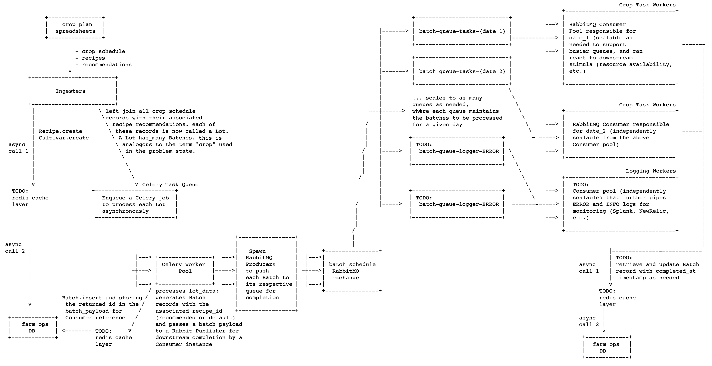

## Bring Up:

```sh
invoke startRabbit # terminal window 1
invoke startCelery # terminal window 2
invoke consume batch-queue-{2022-12-26 00:00:00} # terminal window 3 (use 'batch-queue-{{date}} format to consume batches with different scheduled dates)
invoke runTests # can be run independently at any time (synchronous tests)
```

## Architecture Diagram



&nbsp;
## Approach

In considering this problem, I tried to design the service to support scaling requirements where possible. With that in mind, I most heavily emphasized decoupling the step of ingesting incoming spreadsheet data from the work of actually process the crop (called a Batch for the rest of this document).

Some quick notes:
- data is persisted on a SQLite database (selected for ease of bring up)
- to avoid confusion, I replace the term "crop" from the problem statement with the term "Batch"
    - from the problem statement, I interpreted the term "crop" to be the unit of work to be performed according to the crop_schedule
    - I will use the term Batch to refer to this notion for the rest of this writeup
- each of the rows in the crop_schedule worksheet consists of: 
    - the Cultivar to grow
    - the Batch count
    - its scheduled grow date (and by definition, that of each of its batches)
    - the Farm site to grow it in
- these rows (or groupings of Batches of the same Cultivar on the same day) are called Lots in the codebase
    - note that Lots are not persisted in the database
- TODO: relevant INFO and ERROR logs can be pushed into logger queues to allow for downstream system monitoring

&nbsp;
## The Workflow
#### Ingester:
- spreadsheet files can be passed an instance of the Ingester, which reads through the 3 worksheets (recipes, crop_schedules)
- the Ingester persists any new Recipes or Cultivars included in the spreadsheet in the database
- it then joins the crop schedule rows with their respective recipe recommendations, forming a list of Lots that can be processed into Batches
- the Lots data is then formatted into payloads and enqueued for asynchronous processing through a Celery Task Queue worker (see `enqueue_batches`)

&nbsp;
#### Celery, Lots & RabbitMQ:
- depending on load management, a Celery Worker pool can be scaled (up or down) to support the incoming Lots data for processing
- each Worker is responsible for generating Batches from the Lot data. This is comprised of:
    - normalizing and validating the incoming data (valid associated recipe recommendations, cultivar, dates, etc.)
    - instantiating a persisted Batch record for each batch
        - assigning the corresponding recipe to each Batch (or falling back to the default_recipe if there are no more specific recommendations)
        - TODO: persisting the Batch should go through a cache mechanism (write-behind for example) to maintain consensus while maintaining an async paradigm
        - adding the batch_id to an outgoing batch payload so it can be updated
    - the outgoing batch payload is passed to a RabbitMQ producer/exchange mechanism
        - each queue is dedicated to the Batches that share the same scheduled grow date
    - some advantages to this queue layout:
        - this is to prioritize tasks by date, ensuring that all tasks for a given day are processed first before moving onto tasks for a future day
        - queues can be scaled to allow thousands of days worth of Batches to be categorized and queued for processing ahead of time
        - TODO: queues can be made durable with additional QoS functionality:
            - ensures that data is persisted even through power outages, network failures, etc.
            - at-least-once QoS can be easily be used since the batch_id is included in the Batch payload allowing for idempotent downstream processing
- downstream Consumer instances can be spun up to pull Batch payloads from the requisite Batch/Log queue for further processing

#### TODOs:
- given that this is a timeboxed project, I focused on the happy path implementation while including many TODO notes
    - throughout the codebase, these are notes of actions that I would take to optimize performance, reduce errors or refactor for code readability
    - I also included some additional TODOs for testing, since I ran into some odd behaviour related to using the Peewee DB library
